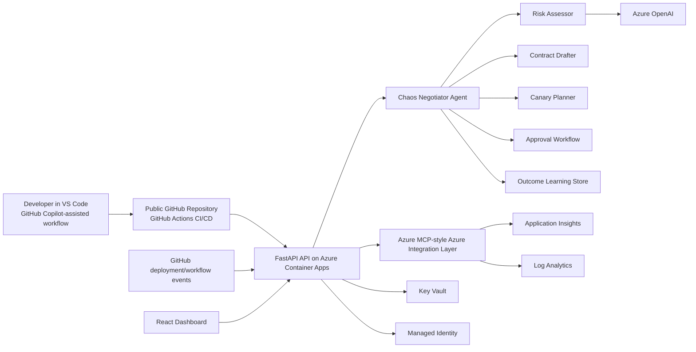

# Submission Architecture Diagram

## Why This Matches The Hackathon

- `Microsoft Agent Framework`: agent orchestration and deployment negotiation flow
- `Azure MCP`: Azure telemetry and cloud integration layer
- `Azure services`: Container Apps, Application Insights, Log Analytics, Key Vault, Managed Identity
- `GitHub + Copilot`: public repo, CI/CD, and Copilot-assisted development workflow
- `Agentic DevOps`: evaluates deployments, applies guardrails, and supports approval and rollout decisions
